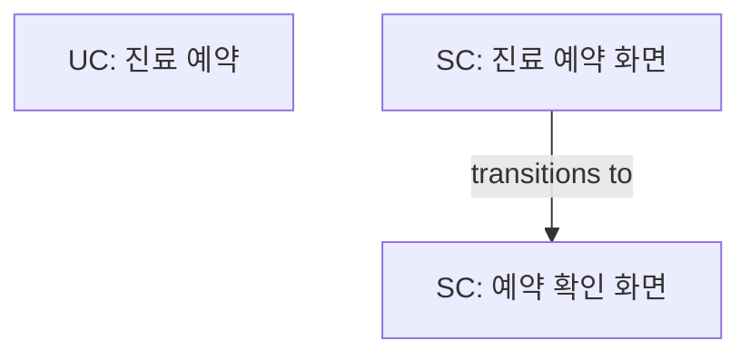
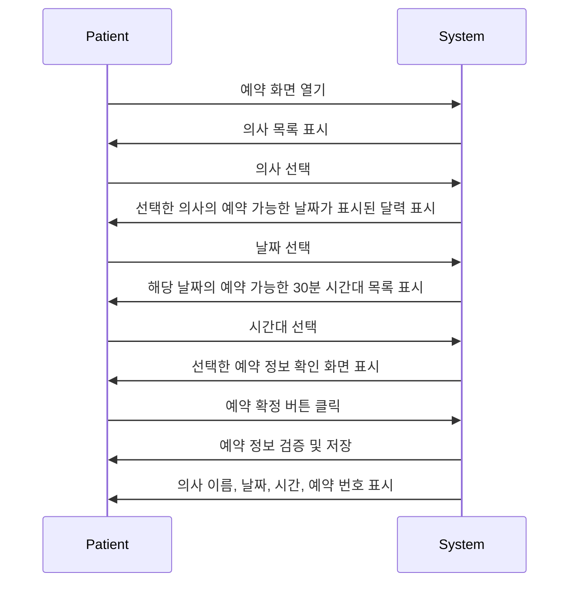
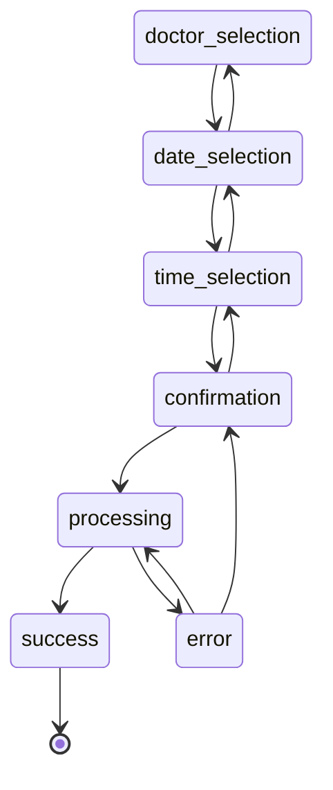
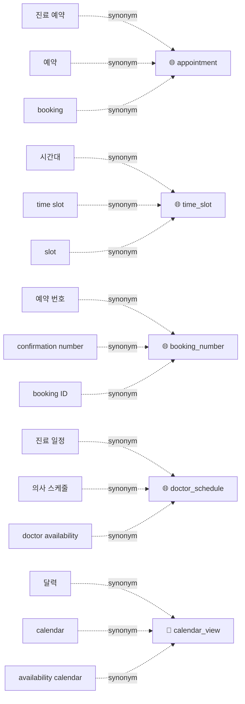

# MasterSpec Analysis Report

**Generated**: 2026-01-12T23:55:06.713Z
**Version**: 0.1.0
**Health Score**: 🟢 Excellent (100/100)

---

## Executive Summary

- **UseCases**: 1
- **Screens**: 2
- **Terms**: 5
- **BDD Scenarios**: 7
- **Rules**: 0
- **Contracts**: 0
- **Issues**: 0 errors, 1 warnings, 4 info

---

## Architecture Overview

---

## UseCases

### UC.appointment_booking - 진료 예약

**Description**: 환자가 의사를 선택하고 날짜와 시간대를 선택하여 진료 예약을 합니다.

- **Actors**: Patient (primary), System (secondary)
- **Flow Steps**: 6
- **Exceptions**: 5
- **Evidence Refs**: 6 fragments
- **Source Interview**: 2026-01-13__usecase.appointment_booking__S001

**Sequence Diagram**:

---

## Screens

### SC.appointment_booking - 진료 예약 화면

**Description**: 환자가 의사, 날짜, 시간대를 선택하여 예약하는 화면

- **States**: 7
- **Transitions**: 11
- **Fields**: 3
- **Actions**: 1
- **Evidence Refs**: 6 fragments
- **Source Interview**: 2026-01-13__usecase.appointment_booking__S001

**State Diagram**:

---

### SC.appointment_confirmation - 예약 확인 화면

**Description**: 예약 완료 후 예약 정보를 보여주는 화면

- **States**: 0
- **Transitions**: 0
- **Fields**: 4
- **Actions**: 0
- **Evidence Refs**: 2 fragments
- **Source Interview**: 2026-01-13__usecase.appointment_booking__S001

---

## Issues & Recommendations

### 🟡 Warnings (1)

- **SC.appointment_confirmation**: Missing state_model definition
  - Screen "예약 확인 화면" has no state_model defined

### 🔵 Info (4)

- **SC.appointment_booking**: Orphaned screen - not referenced by any UseCase
  - Screen "진료 예약 화면" is not explicitly referenced in any UseCase
- **SC.appointment_confirmation**: Orphaned screen - not referenced by any UseCase
  - Screen "예약 확인 화면" is not explicitly referenced in any UseCase
- **Term: doctor_schedule**: Orphaned term - not referenced in any component
  - Term "doctor_schedule" is not used in UseCases or Screens
- **SC.appointment_booking**: Circular state transitions detected
  - Cycles found: doctor_selection -> date_selection -> time_selection -> confirmation -> processing -> error -> confirmation, doctor_selection -> date_selection -> time_selection -> confirmation -> processing -> error -> processing, doctor_selection -> date_selection -> time_selection -> confirmation -> time_selection, doctor_selection -> date_selection -> time_selection -> date_selection, doctor_selection -> date_selection -> doctor_selection

---

## Glossary Overview

- **Total Terms**: 5
- **Synonym Collisions**: 0

| Term | Definition | Scope |
|------|------------|-------|
| appointment | 환자가 의사와 진료를 받기 위해 예약하는 것 | global |
| time_slot | 예약 가능한 30분 단위의 시간대 | global |
| booking_number | 예약 확정 시 생성되는 고유 식별 번호 | global |
| doctor_schedule | 의사별 진료 가능한 날짜 및 시간대 정보 | global |
| calendar_view | 예약 가능한 시간대가 표시된 달력 UI | local |

**Term Relationships**:

---

## BDD Coverage

- **Total Scenarios**: 7
- **Happy Path**: 2
- **Error Cases**: 5
- **Edge Cases**: 1

---

## Metrics Summary

| Metric | Value |
|--------|-------|
| Avg Flow Steps per UseCase | 6 |
| Avg States per Screen | 3.5 |
| Avg Exceptions per UseCase | 5 |
| Avg Evidence Refs per Component | 4.7 |
| Health Score | 100/100 |

---

## Recommendations

1. ✅ Address the warnings listed above to improve spec quality
3. ✅ Document API contracts for external integrations
4. ✅ Add state_model definitions to all screens for clarity
